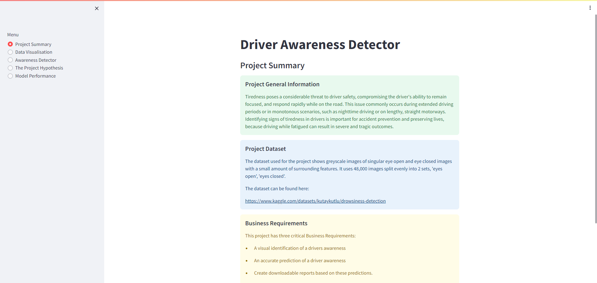

# Driver Awareness Detector

## Table of Contents
1. [Dataset Content](#dataset-content)
2. [Business Requirements](#business-requirements)
3. [Hypothesis and Validation](#hypothesis-and-validation)
4. [Model Rationale](#model-rationale)
5. [User Stories](#user-stories)
6. [Business Requirements Rationale and Mapping](#business-requirements-rationale-and-mapping)
7. [Machine Learning Business Case](#machine-learning-business-case)

The inspiration for this project stems from my current employer, Wayve, a company dedicated to embodying AI within self-driving cars. I aimed to align the project with this industry by focusing on creating a system capable of detecting signs of tiredness in individuals behind the wheel.

### Deployed Dashboard [here](https://driver-awareness-detector-cac7971f0415.herokuapp.com/)

## Dataset Content
The dataset used for the project shows greyscale images of singular eye open and eye closed images with a small amount of surrounding features. It uses 48,000 images split evenly into 2 sets, 'eyes open', 'eyes closed'. 

Identifying signs of tiredness in drivers is important for accident prevention and preserving lives, because driving while fatigued can result in severe and tragic outcomes. 

The dataset is sourced from [Kaggle](https://www.kaggle.com/datasets/kutaykutlu/drowsiness-detection).

## Business Requirements

In response to the escalating incidence of vehicle accidents attributed to tired driving, there is a recognized demand for machine learning sytem. The objective is to demonstrate the capability of machine learning in analyzing human eye movements, specifically focusing on its 'openness' to identify potential signs of driver tiredness. The project encompasses three essential business requirements, A visual identification of a drivers awareness, An accurate prediction of a driver awareness, create downloadable reports based on these predictions.

Successfully meeting these requirements serves as a proof of concept, paving the way for subsequent development. The ultimate aim is to create a real-time video machine learning system for the detection of drowsiness. 

Further details on the business requirements are provided below.

1. Visual Assessment of Driver Awareness

The system will conduct image analysis to visually distinguish between drivers who are alert and those who are not. The focus of this analysis will be on evaluating the 'openness' of the drivers' eyes to identify potential indicators of tiredness.

2. Accurate Prediction of Driver Awareness

The model will be designed as a binary classifier, employing machine learning algorithms and computer vision techniques to precisely predict whether a given driver is starting to show signs of tiredness based on their eye state.

3. Generation of Downloadable Reports

Following the analysis of a driver's eye, the system will generate detailed prediction reports for each examination. These reports will contain information such as the date and time of the examination, the outcome of the prediction, 'Eyes Open' or 'Eyes Closed', and the associated probability. Users will be able to download these reports for reference and further analysis.

## Hypothesis and Validation

* Hypothesis 1:

It is said that tired drivers may show a higher degree of closed eyes compared to alert drivers.

* Validation:

To validate this hypothesis, we conducted an analysis of the dataset, specifically focusing on the average degree of eye openness and closedness.

Using Machine Learning, it was shown that the average degree of eye openness in fatigued drivers is notably lower than that observed in alert individuals. This observation is reinforced by the examination of both Average Image and Variability Images, highlighting the distinction between eyes open and eyes closed.

* Hypothesis 2:

It is said that a machine learning model can discern a visual pattern to classify closed and open eyes with an accuracy surpassing 90%.

* Validation:

To validate this hypothesis, a machine learning model was trained on the dataset, and its performance was evaluated. The model achieved an accuracy exceeding 90% on the test set, thereby substantiating the hypothesis.

## Model Rationale

I utilized the Keras Tuner to optimize the model's parameters.
Let's delve into each element:

* Convolutional Layers

The model integrates three convolutional layers, essential for analyzing image data and capturing spatial hierarchies of features. Multiple layers enable the model to grasp more complex features, detecting basic elements in initial layers and intricate patterns associated with the eye's state in deeper layers.

* MaxPooling Layers:

After each convolutional layer, a MaxPooling layer reduces computational requirements by shrinking feature maps while preserving crucial information.

* Flatten Layer:

This layer transforms the 3D output from prior layers into a 1D vector, making it compatible with dense layers.

* Dense Layers:

After a parameter search, it was determined that 128 units in the dense layer strike a balance between model complexity and the risk of overfitting, allowing the model to capture sufficient information without becoming overly complex.

* Dropout Layer:

A dropout rate of 0.5 means roughly half of the input units are dropped out during each training step, encouraging generalization and preventing overfitting.

* Output Layer:

The model employs a sigmoid activation function, suitable for binary classification.

* Activation Function - ReLU:

ReLU adds non-linearity efficiently and helps avoid the vanishing gradient issue in backpropagation.

* Loss Function - Binary Crossentropy:

This measures the difference between actual and predicted probabilities, suitable for binary classification.

* Optimizer - Adam:

Adam is a good choice because it adapts its learning rate for each parameter, making the model converge faster without overshooting.

## User Stories
1. As a User, I want to view average images and image variances for 'eyes open' and 'eyes closed' to easily discern the distinctions between the two states.

2. As a User, I want to see a collection of images from each category to gain a understanding of the standard features within each image classification.

3. As a User, I want a machine learning tool that analyzes images and provides predictions on the state of the eyes, enabling quick and reliable assessments.

4. As a User, I want to view the prediction probability associated with each analysis to see the models accuracy.

5. As a User, I want a machine learning tool to deliver a minimum accuracy of 90%, ensuring a reliable basis for decision-making and giving confidence in the model's capabilities.

6. As a User, I want the ability to upload multiple images in one session.

7. As a User, I want a straightforward option to download a detailed report of the model predictions for record-keeping and further analysis.

## Business Requirements Rationale and Mapping

### Business Requirement 1: Visual Assessment of Driver Awareness
The system will conduct image analysis to visually distinguish between drivers who are alert and those who are not. The focus of this analysis will be on evaluating the 'openness' of the drivers' eyes to identify potential indicators of tiredness.

- **User Story 1:** As a User, I want to view average images and image variances for 'eyes open' and 'eyes closed' to easily see the differences between the two states.
- **User Story 2:** As a User, I want to see a collection of images from each category to gain an understanding of the standard features within each image classification.

These user stories have been addressed through the following:
1. The Data Visualization page in the Streamlit dashboard web tool provides a user-friendly display.
2. This page allows users to view a montage of each category, composed of random images from each.
3. Within the Data Visualization page, users can observe both Average Variability and the difference between the two categories.

### Business Requirement 2: Accurate Prediction of Driver Awareness
The model will be designed as a binary classifier, employing machine learning algorithms and computer vision techniques to precisely predict whether a given driver is starting to show signs of tiredness based on their eye state.

- **User Story 3:** As a User, I want a machine learning tool that analyzes images and provides predictions on the state of the eyes, enabling quick and reliable assessments.
- **User Story 4:** As a User, I want to view the prediction probability associated with each analysis to see the model's accuracy.
- **User Story 5:** As a User, I want a machine learning tool to deliver a minimum accuracy of 90%, ensuring a reliable basis for decision-making and giving confidence in the model's capabilities.
- **User Story 6:** As a User, I want the ability to upload multiple images in one session.

These user stories are addressed through the following implementation:
1. The Awareness Detector page allows users to upload single or multiple images at a time.
2. It displays the prediction beneath the uploaded image, and a graph shows the percentage probability for an accurate prediction.
3. The Model Performance page presents a table showing the Accuracy and Loss of the model.

### Business Requirement 3: Generation of Downloadable Reports
Following the analysis of a driver's eye, the system will generate detailed prediction reports for each examination. These reports will contain information such as the date and time of the examination, the outcome of the prediction, 'Eyes Open' or 'Eyes Closed' and a percentage scale for this prediction. Users will be able to download these reports for reference and further analysis.

- **User Story 7:** As a User, I want a straightforward option to download a detailed report of the model predictions for record-keeping and further analysis.

This user story is addressed through the implementation of the system generating detailed reports for each examination, which users can download for reference and further analysis.

1. The Awareness Detector page allows users to download the full report of the predictions for any and all of the images they upload to the detector tool.

## Machine Learning Business Case

**Objective:** 
- This project aims to use machine learning to create a reliable tiredness detection system for drivers. The system will categorize images into 'Eyes Open' and 'Eyes Closed', serving as a proof of concept for its effectiveness.

**Success Metrics:** 
- The model's success will be measured by achieving an accuracy of 90% or higher on the test set. It will provide clear indications of the state of a drivers eyes, along with probability scores for each prediction.

**Future uses:**
- This project could pave the way for advancements like real-time video analysis and alert the system if a driver is becoming tired through their eye state.

**Dataset:** 
- The dataset used for this project is from Kaggle, consisting of grayscale images labeled as "Eyes Open" or "Eyes Closed." These images form the basis for training and validating the model.

## Dashboard Design
The dashboard for this project was developed using Streamlit. 

It consists of five pages: 
- Project Summary
- Data Visualization
- Awareness Detector
- Project Hypothesis
- Model Performance

### Project Summary
This page contains information about the project, including general information, details about the dataset used, and a list of business requirements. 

Project Summary

### Data Visualization
The Data Visualization page shows the variability between 'eyes open' and 'eyes closed' images, providing mean or average images for each category and displaying the difference between those averages. 

Average and Variabilty

Average 'Eyes Open' and 'Eyes Closed' with Difference

 

This page also presents a montage of random images for both 'Eyes Open' and 'Eyes Closed' labels. Users can choose the category they want to view from a dropdown menu.

Montage

'Eyes Open' montage

'Eyes Closed' montage

### Awareness Detector
On this page, users can upload images from the dataset to determine whether the eyes are classified as 'Eyes Open' or 'Eyes Closed.' A link to the original dataset is provided for users to download images for the detector. The model has demonstrated some exellent results on images that were NOT part of the training set. After uploading, the page performs an analysis and provides a prediction of the eye state, indicating whether it is 'Eyes Open' or 'Eyes Closed.'

Image upload

 

Below, you can observe assessments for a couple of images from the trained set, along with their corresponding prediction results. Additionally, an image not included in the training set is presented, along with its prediction results.

Assessment 1

Assessment 2

Non Trained Image Results

Prediction Results Graph

### Project Hypothesis
This page presents the hypothesis for the project and the corresponding conclusions drawn based on the findings and model training.

Show Hypothesis

### Model Performance

This section offers an overview of the data distribution, highlighting distinctions between test, train, and validate sets, along with their respective ratios.

Two graphs show the model's performance, focusing on Accuracy and Loss. The concluding graph features the confusion matrix, supported by an explanation. Additionally, a chart provides a summary of the model's overall performance in terms of Loss and Accuracy, measured in '%'.

Image Distribution Graph

Accuracy and Val_Accuracy

Loss and Val_Loss

Prediction % and Confusion Matrix

## Bugs

| **Bug** | **Fix** |
| ------- | ------- |
| Non trained image upload causing type error | Adjusted code to check number of image channels and if the image is RGBA when resizing image. Make adjustments where necessary
|

### Heroku Deployment
This application has been deployed from GitHub to Heroku by following the steps: 
1. Create a requirement.txt file in GitHub, for Heroku to read, listing the dependencies the program needs in order to run.
2. Set the runtime.txt Python version to a version that the current Heroku stack supports.
3. Push the recent changes to GitHub and go to your Heroku account page to create and deploy.
4. Chose "CREATE NEW APP", give it a unique name, and select a geographical region.
5. From the Deploy tab, chose GitHub as deployment method, connect to GitHub and search for and select the project's repository.
6. Select the branch you want to deploy, then click Deploy Branch.
7. Click to "Enable Automatic Deploys " or chose to "Deploy Branch" from the Manual Deploy section.
8. Wait for the logs to run while the dependencies are installed and the app is being built.
9. The mock terminal is then ready and accessible from a link similar to https://your-projects-name.herokuapp.com/
10. If the slug size is too large then add large files not required for the app to the .slugignore file, similar to the .gitignore file.

### Fork Repository
To fork the repository by following these steps:
1. Go to the GitHub repository
2. Click on Fork button in upper right hand corner

### Clone Repository
You can clone the repository by following these steps:
1. Go to the GitHub repository 
2. Locate the Code button above the list of files and click it 
3. Select if you prefere to clone using HTTPS, SSH, or Github CLI and click the copy button to copy the URL to your clipboard
4. Open Git Bash
5. Change the current working directory to the one where you want the cloned directory
6. Type git clone and paste the URL from the clipboard ($ git clone https://github.com/YOUR-USERNAME/YOUR-REPOSITORY)
7. Press Enter to create your local clone.
